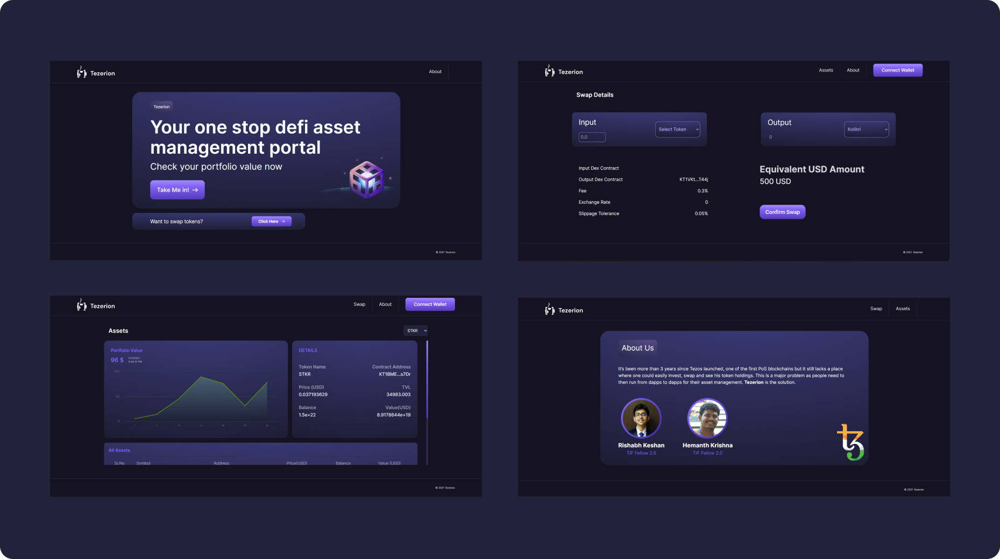

# Tezerion

> Your one stop defi asset management portal on the Tezos ecosystem

It’s been more than 3 years since Tezos launched, one of the first PoS blockchains but it still lacks a place where one could easily invest, swap and see his token holdings. This is a major problem as people need to then run from dapps to dapps for their asset management.

**Tezerion.io** is the solution for getting rid of this hassle.

## Features

- Check live prices of your Tezos assets(Updates every 5 mins)
- Swap tokens using our Quipuswap Integration
- Check history of recent transactions(in progress)
- Buy and manage your NFTs(in progress)
- Calculate tax on your crypto assets(in progress)

# Getting Started

- Clone the repo. `https://github.com/rishabhkeshan/tezerion-frontend.git`
- Download the dependencies. Run `npm install`
- Start the server. `npm start`
- Your project must be running on http://localhost:3000

## Contributing

Want to add a new feature? Found a bug?

1. Fork the repository to your own Github account
2. Clone the project to your machine
3. Create a branch locally with a succinct but descriptive name(`git checkout -b feature/FeatureName`)
4. Commit changes to the branch(`git commit -m 'feat : added feature'`)
5. Push changes to your fork(`git push origin feature/FeatureName`)
6. Open a PR in our repository :)

## Authors

<table>
	<tr>
  <td align="center">
			<a href="https://github.com/rishabhkeshan"> <b>Rishabh Keshan</b></a> 
		</td>
		<td align="center">
			<a href="https://github.com/DarthBenro008"> <b>Hemanth Krishna</b></a>
		</td>
	</tr>
</table>

 